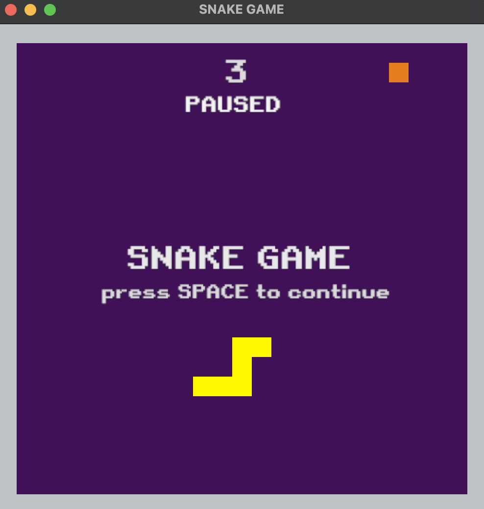

# Snake Game in Rust 

Welcome to the Snake Game implemented in Rust! This project serves as a learning resource for Rust programming, demonstrating key concepts and features of the language. Whether you're new to Rust or looking to reinforce your skills, this project provides a practical example of building a simple game using the Rust programming language.




## Learning Objectives

1. **Enums and Structs:** Explore the use of enums and structs to model game entities such as the snake, blocks, and directions.

2. **Concurrency and Ownership:** Understand how Rust's ownership system helps manage memory and prevents data races, even in a simple game.

3. **Error Handling:** Learn about Rust's robust error handling mechanisms and how they contribute to writing reliable and safe code.

4. **Pattern Matching:** Discover the power of pattern matching in Rust, utilized for handling keyboard input, game logic, and drawing.

5. **Piston Window Library:** Familiarize yourself with the Piston Window library, a simple 2D graphics engine for Rust, and its usage in creating the game window and handling events.


## Structures and Constants

- **Direction:** An enumeration representing possible directions for the snake (up, down, left, right).
- Constants for titles, messages, and colors used in the game:
  - Field color
  - Food color
  - Snake color
  - Border color
  - Game over screen color

## Game Structure (Game)

- Maintains the game state, including the snake, food, game status, update time, pause status, last removed block, and score.
- Methods for handling keyboard input, generating random food, updating the game state, moving the snake, checking if the snake is eating, restoring the snake's tail, and checking if the snake is alive.
- Methods for drawing the board, pause information, game over screen, as well as drawing the snake and food.

## Snake Structure (Snake)

- Represents the snake in the game with a vector of blocks and the direction it is moving.
- Initializes the snake with an initial position and default direction.

## Block Structure (Block)

- Represents a block in the game, either part of the snake's body or the food.
- Has methods to create a block at a specific position, generate a random block, and draw the block on the screen.

## Main Function (main)

- Configures the game window, loads the font, and initializes the game state.
- A main loop that handles events, draws the current game state, and updates the game state.

## Window Creation Function (create_window)

- Initial window settings, such as title and size, and creates the window using the `piston_window` library.

In summary, the code creates a simple "Snake" game in Rust, where the player controls a snake that must eat food to grow and earn points. The game features functionalities like pausing, restarting, and displaying a game over screen.

# Usage Guide

## Overview

This Rust project implements a Snake game using the `piston_window` library. The guide covers basic usage instructions, documentation generation, debugging in Visual Studio Code, and generating a release version.

## Prerequisites

Before getting started, ensure that you have the following prerequisites installed on your system:

- [Rust](https://www.rust-lang.org/learn/get-started)
- [Visual Studio Code](https://code.visualstudio.com/) - Optional

## Clone the Repository

```bash
git clone https://github.com/your-username/snake-game-rust.git
cd snake-game-rust
``````

## Running the Game

To run the Snake Game, use the following command in your terminal:

```bash
cargo run
```

This command will compile and execute the game.

## Generating Documentation

To generate documentation for the Snake Game, run the following command:

```bash
cargo doc --open
````

This will generate and open the documentation in your default web browser.

# Debugging in Visual Studio Code

To debug the Snake Game in Visual Studio Code, follow these steps:

1. Open the project in Visual Studio Code using the following command:

    ```bash
    code .
    ```

2. Navigate to the "Run" view on the sidebar or press `Ctrl + Shift + D`.

3. Click on the "Run" button to start debugging. Alternatively, set breakpoints in the code and use the "Run and Debug" option.

Now, you can debug the Snake Game within Visual Studio Code.

# Generating a Release Version

To generate a release version of the Snake Game, use the following command:

```bash
cargo build --release
```

This will generate a release version of the game in the `target/release` directory.


## Contributing
If you would like to contribute to the project, feel free to fork the repository, make changes, and create a pull request.

## Issues and Support
If you encounter any issues or have questions, please create an issue on the project's GitHub repository.

